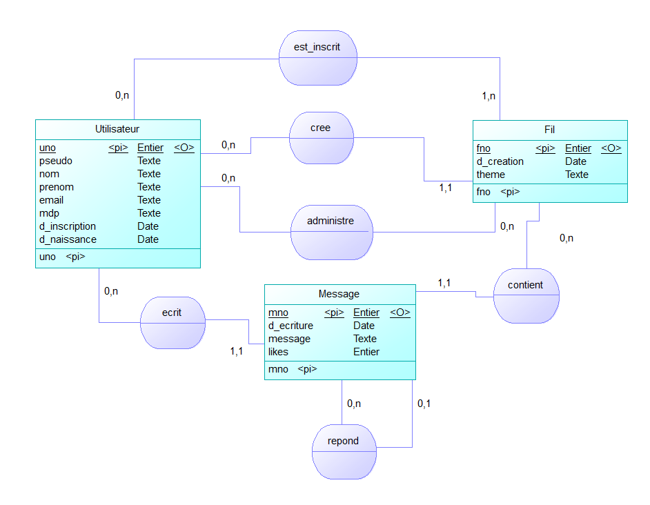

# SAE 4.02.1 - UniVerseLille

### Créé par Nathan Marquis et Axel Wilfart

## Introduction

Bienvenue dans ce descriptif du projet UniVerseLille ! Ce projet est une plateforme en ligne de discussions instantanées destinée aux usagers de l'Université de Lille.
Dans ce README, vous trouverez toute la procédure de création du projet, de la modélisation, jusqu'aux points techniques difficiles et comment ils ont été réglés.

## Sommaire

- [Description générale](#description-générale-de-lapplication)
- [Modélisation de la Base de donnée](#modélisation-de-la-base-de-donnée)
- [Requêtes sur la Base de donnée](#requêtes-pertinentes-sur-la-base-de-donnée)
- [Arborescence globale de l'application](#arborescence-globale-de-lapplication)
- [Entrées et fonctionnalités des contrôleurs](#entrées-et-fonctionnalités-des-contrôleurs)
- [Difficultés rencontrées et leurs solutions](#difficultés-rencontrées-et-leurs-solutions)

## How to
1. Télécharger l'archive [UniVerseLille](https://gitlab.univ-lille.fr/nathan.marquis.etu/S4.02.1/-/archive/main/S4.02.1-main.zip)
2. Extraire l'archive dans un le dossier `webapps` d'un [tomcat](https://tomcat.apache.org/download-11.cgi) (tomcat>webapps>UniVerseLille)
3. Dans un terminal, se rendre dans WEB-INF/sql (`cd WEB-INF/sql`)
4. Se connecter à psql avec la commande `psql -U prenomnometu but2` en replaçant bien `prenomnometu` par votre prénom et nom suivi de etu
5. Executez le script `\i insertion.sql` (Cela devrait également créer les tables)
6. Quittez psql avec `\q`
7. Allez dans le dossier WEB-INF/src/modeles/dao (`cd ../src/modeles/dao`)
8. Ouvrez le fichier `DS.java` et replacez "prenomnometu" par votre prenom et nom suivis de etu (changer également l'URL si nécessaire)
9. Allez dans le dossier WEB-INF (`cd ../../../`)
10. Executez la commande `javac -d classes -cp "lib/*:src" src/**/*.java`
11. Allez dans le dossier bin de votre tomcat (`cd ../../../bin/`)
12. Executez le script `./catalina.sh run`
13. Ouvrez un navigateur et rendez-vous sur le lien [localhost:8080/UniVerseLille/](http://localhost:8080/UniVerseLille/)

## Description générale de l'application

UniVerseLille est une plateforme en ligne de messagerie instantanée, où vous pouvez créer un compte, 
créer des fils de discussion, ajouter et supprimer des utilisateurs de ces fils et bien évidemment, envoyer des messages.
Vous avez également le choix entre deux thèmes : clair ou sombre


## Modélisation de la base de donnée

Pour commencer la création d'UniVerseLille, un réseau social web pour l'Université de Lille, nous avons mis en place un **modèle conceptuel de données (MCD)** :

 

Puis un **MLD** (Les clés primaires sont en italique et les clés etrangères ont un '#' devant) : 

> Utilisateurs(_uno_, pseudo, nom, prenom, email, mdp, d_inscription, d_naissance)
> 
> Fils(_fno_, titre, d_creation, #uno_createur)
> 
> Inscriptions(_uno_, _#fno_)
> 
> Administrations(_uno_, _#fno_)
> 
> Messages(_mno_, #uno, #fno, contenu, imgPath, d_ecriture, #mno_reponse, likes)

## Requêtes pertinentes sur la Base de donnée

Voici quelques requêtes pertinentes à faire sur les données contenues dans la base de données, avec leur résultat : 

```
--Sélectionne toutes les informations de l'utilisateur 1
select pseudo, nom, prenom, email, d_inscription, d_naissance
from utilisateurs
where uno=1;

--Sélectionne tous les messages du fil n°2, et le nom de celui qui a ecrit ce message et les ranges dans l'ordre des plus récents
select prenom,nom,contenu
from messages as m, utilisateurs as u
where m.uno=u.uno
and m.fno = 2
Order by m.d_ecriture;

--Sélectionne tous les utilisateurs d'un fil et affiche leurs pseudos
select pseudo
from utilisateurs as u, inscriptions as i
where u.uno = i.uno
and i.fno = 1;

--Sélectionne un seul message précis, et affiche aussi le message auquel il répond
select contenu
from messages
where mno = 5
union
select contenu
from messages
where mno = (select mno_reponse
             from messages
             where mno = 5);

--Sélectionne tous les fils de l'utilisateur 1
select titre
from fils as f, inscriptions as i
where i.fno = f.fno
and i.uno = 1;

--Sélectionne tous les fils de l'utilisateur 1 et tous les messages qu'il a envoyé
select titre, contenu
from fils as f, inscriptions as i, messages as m
where i.fno = f.fno
and m.fno = i.fno
and m.uno = i.uno
and i.uno = 1;

--Sélectionne tous les messages d'un utilisateur dans un fil
select titre, contenu
from fils as f, inscriptions as i, messages as m
where i.fno = f.fno
and m.fno = i.fno
and m.uno = i.uno
and i.fno = 2
and i.uno = 1;
```

## Arborescence globale de l'application

```
UniVerseLille
│   .gitignore
│   README.md
│   S4.02.1.iml
│   signin.jsp
│   signup.jsp
│
├───.idea
│   │   .gitignore
│   │   misc.xml
│   │   modules.xml
│   │   sqldialects.xml
│   │   vcs.xml
│   │   workspace.xml
│   │
│   └───libraries
│           lib.xml
│
└───WEB-INF
    │   Accueil.jsp
    │
    ├───classes
    │
    ├───lib
    │       commons-text-1.13.0.jar
    │       jackson-annotations-2.15.3.jar
    │       jackson-core-2.15.3.jar
    │       jackson-databind-2.15.3.jar
    │       jackson-dataformat-xml-2.15.3.jar
    │       jackson-datatype-jsr310-2.18.3.jar
    │       jakartaee-migration-1.0.8-shaded.jar
    │       postgresql-42.7.4.jar
    │       servlet-api.jar
    │
    ├───res
    │       MCD_UniVerseLille.mcd
    │       MCD_UniVerseLille.png
    │       SAe_S4_sujet_ReseauSocial.pdf
    │
    ├───sql
    │       creation.sql
    │       insertion.sql
    │       requetes.sql
    │
    ├───src
    │   ├───controlleurs
    │   │       AjouterParticipant.java
    │   │       Connexion.java
    │   │       ControleurRest.java
    │   │       Dispatcher.java
    │   │       Inscription.java
    │   │       NouveauFil.java
    │   │       NouveauMessage.java
    │   │
    │   └───modeles
    │       ├───dao
    │       │       AdministrationDAOJdbc.java
    │       │       DS.java
    │       │       FilDAOJdbc.java
    │       │       InscriptionDAOJdbc.java
    │       │       MessageDAOJdbc.java
    │       │       UtilisateurDAOJdbc.java
    │       │
    │       └───dto
    │               Fil.java
    │               Message.java
    │               Utilisateur.java
    │
    └───tests
            TestFilDAOJdbc.java
            TestMessageDAOJdbc.java
            TestUtilisateurDAOJdbc.java

```

## Entrées et fonctionnalités des contrôleurs

Voici les différentes fonctionnalités présentes dans l'application, ainsi que les controleurs qui les exécutent :

**Gestion des utilisateurs :**
- Créer un utilisateur : signup.jsp → Inscription
- Se connecter en tant qu'utilisateur : signin.jsp → Connexion
- Afficher les utilisateurs d'un fil : Dispatcher → Accueil.jsp

**Gestion des Fils :**
- Créer un fil : Accueil.jsp → NouveauFil
- Afficher les fils disponibles pour un utilisateur : Dispatcher → Accueil.jsp
- Modifier les utilisateurs d'un fil si admin : Accueil.jsp → AjouterParticipant

**Gestion des Messages :**
- Créer un nouveau message : Accueil.jsp → NouveauMessage
- Afficher les messages d'un fil : Dispatcher → Accueil.jsp
- Répondre à un message existant
- Mettre un like ou l'enlever

**API Rest :**
- Accès à tous les fils de l'utilisateur connecté et à tous les messages de ces fils : allMessages/*

## Difficultés rencontrées et leurs solutions

Voici les quelques difficultés que nous avons rencontrées :

- Difficulté lors de la question de la persistance des données entre les servlets,
qui demande une réflexion poussée, mais qui a quand même été résolu dans tous les cas.

- Difficulté de la gestion du temps, notamment au niveau du regroupement tardif de l'équipe. Pour palier à ça, 
nous nous sommes concentrés sur les fonctionnalités principales et qui permettent à notre application Web d'être utilisable.

- Difficulté lors de la gestion des images, et comme nous n'avions plus beaucoup de temps avant la Deadline, cette étape est passé au travers.